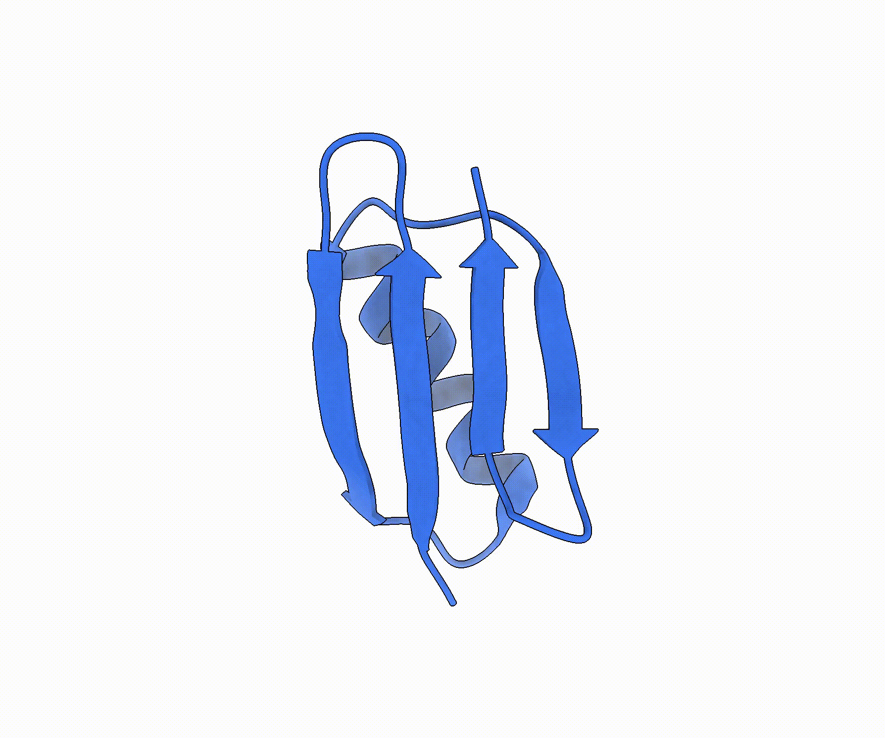
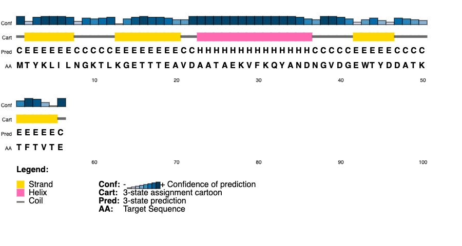

# MODELING EMPLOYING LIMITED DATA (MELD) in AMBER

## Leraning Outcomes
* Be able to setup and run replica exchange MELD simulation in parallel on GPUs.

## Introduction

Predicting how a protein folds into its native structure from sequence alone is a long-standing problem in computational biology. In theory, molecular dynamics should be able to do so, since the force field establishes an energy landscape with the native state as its global minimum, and molecular dynamics provides not just a single predicted structure but also the populations and mechanisms involved. In reality, however, the bottleneck lies in sampling: the conformational space of even a small polypeptide is prohibitively large, and proteins fold on microsecond-to-millisecond timescales that brute-force atomistic MD cannot reach without specialized hardware.

MELD (Modeling Employing Limited Data) tackles this by combining physics with external information in a Bayesian framework: the force field acts as the prior, the external data provides the likelihood, and MELD then samples the resulting posterior. Unlike conventional restrained molecular dynamics, MELD is designed to make use of information that is vague, sparse, or only partly correct. Restraints are organized into groups and collections, and at any given time, only a certain fraction of them needs to be fulfilled. During the simulation, the best-satisfied subset of restraints is activated on the fly, so it works out which restraints are correct as the protein folds, rather than being forced to obey all the restraints. When folding is carried out on the basis of the amino acid sequence, the restraints are derived from the Coarse Physical Insights (CPI): general truths about globular proteins — namely, that they have hydrophobic cores, that they form secondary structure, and that their β-strands pair. The sampling is carried out using Hamiltonian and temperature replica exchange (H,T-REMD), with the hot replicas, which have weak restraints, exploring a wide range of conformations and the cool replicas, which have fully-scaled restraints, adopting structures that are similar to the native ones.<sup>[[1](https://www.pnas.org/doi/10.1073/pnas.1506788112),[2](https://www.pnas.org/doi/10.1073/pnas.1515561112)]</sup>



In this tutorial you will fold the B1 domain of protein G (PDB: 3GB1) starting from its sequence. You will build the system with `tleap` (ff19SB, implicit solvent) and minimize it, generate CPI restraints, run an H,T-REMD MELD simulation in parallel across GPUs, and analyze the resulting trajectories to identify the folded state as a dominant, low-energy population.

**Assumptions**: This tutorial assumes that you have experience building systems using ```tleap```, running MD simulations in parallel with ```pmemd.cuda.MPI```, knowledge on terminology and typical variables used for standard MD simulations in ```AMBER```, and ```MELD```. <br>If you are not familiar with setting up a system, running MD simulations please refer to the more basic tutorials before attempting to run ```Replica Exchange MELD``` simulations.

## Method

### 1. System setup

This is the earliest stage where we create the topology and the initial coordinate file for the intended system 3GB1. Because MELD begins from an extended chain and lets the restraints and the force field guide the fold, the starting geometry carries no structural information.

For this tutorial we will generate initial peptide chain using the sequence  alone. Use following command to download the FASTA entry for 3GB1 from the PDB.
```
curl -o 3gb1.fasta https://www.rcsb.org/fasta/entry/3GB1
```
<i>Note that we take only the sequence from this entry. The deposited coordinates are never read; they are reserved for the final validation step, where the folded ensemble is compared against the experimental structure.</i>

The chain is then built with `tleap`. We use the `ff19SB` force field with `mbondi2` radii, which are the radii appropriate for the `igb=5` generalized Born model. Rather than writing the `tleap` input by hand, the helper script [makeLeap.x](1_system_setup/makeLeap.x) translates the one-letter FASTA sequence into the three-letter residue names that `tleap` expects.

Run [makeLeap.x](1_system_setup/makeLeap.x)  with the following commands for 3GB1:
```
chmod +x makeLeap.x
./makeLeap.x -s 3gb1.fasta -o 3gb1 
```
This writes [leap.in](1_system_setup/leap.in). Execute it, capturing the output so that nothing is missed:
 ```
 tleap -f leap.in 2> leap.log
 ``` 
 Read leap.log before continuing. Warnings about unperturbed charge for the built chain are ignored since implicit solvent simulation. However, any errors about unrecognized residues or missing parameters must be resolved at this stage because they will cause the system to be unrunnable later. A successful run produces [3gb1.prmtop](1_system_setup/3gb1.prmtop) and [3gb1.inpcrd](1_system_setup/3gb1.inpcrd).
 
Next we apply Hydrogen Mass Repartitioning (HMR)<sup>[[3](https://doi.org/10.1021/ct5010406)]</sup>. HMR shifts mass from heavy atoms to the hydrogens bonded to them, slowing the fastest bond vibrations without changing the total mass or thermodynamics of the system. This allows a longer timestep of about 4 fs instead of the usual 2 fs. The repartitioning is handled by `ParmED`, which ships with AMBER, using the input file [HMR.in](1_system_setup/HMR.in):
```
parm 3gb1.prmtop
hmassrepartition
outparm 3gb1_HMR.prmtop
quit
```
To execute simply use command:
```
parmed -i HMR.in
```
This creates [3gb1_HMR.prmtop](1_system_setup/3gb1_HMR.prmtop), which is used for the remainder of the tutorial. Note that the coordinate file has not changed: only the masses have been redistributed.

Lastly, we carry out a minimization. Since MELD is in charge of guiding the chain to its native fold, we are not attempting to pre-organise the structure in any way; our only requirement is to eliminate the steric clashes and strained geometries that tleap leaves behind when it assembles the chain from scratch, so that the initial steps of the dynamics do not fail. A brief minimisation in implicit solvent is enough.

```
energy minimization
 &cntrl
  imin=1, maxcyc=2000, ncyc=500,
  ntwr = 1000, ntpr = 100,
  cut = 999.0, rgbmax = 999.0,
  ntb = 0, igb = 5, saltcon = 0.0,
 /
 ```
The above settings follow from implicit-solvent treatment. The flag `ntb = 0` removes periodic boundaries while `igb = 5` selects the generalized Born model, so there is no solvent box and no cutoff is needed (`cut = 999.0`, `rgbmax = 999.0`).

Run the minimization using [min.in](1_system_setup/min.in):
```
srun $AMBERHOME/bin/pmemd -O -i min.in -p 3gb1_HMR.prmtop -c 3gb1.inpcrd -o min.out -r min.rst -inf min.info
```
Check min.out and confirm that the energy has decreased smoothly and converged, with no `NaN` values. The resulting [min.rst](1_system_setup/min.rst) is the coordinate file from which every replica of the MELD simulation will be launched, so it is worth inspecting visually before committing to the far more expensive stages ahead. What you should see is an extended, unfolded chain with clean bond geometry and no overlapping atoms.


### 2. MELD Replica Exchange MD
With a topology and a relaxed starting structure in hand, we now proceed with constructing the information that will direct the folding. For this purpose two programs are used: [gen_restraints.py](2_meld_remd/gen_restraints.py) converts a secondary structure string into the restraint files which tell MELD what it knows about the protein, and [gen_md_inputs.py](2_meld_remd/gen_md_inputs.py) takes a single Amber input file and expands it out into the series of replicas that shows how this knowledge is applied throughout the ensemble.

#### 2.1. CPI restraints:
The Coarse Physical Insights introduced above are, in practice, primarily 3 collections of distance and torsion restraints. None of them requires knowledge of the native structure; all that is needed is the sequence and a prediction of the secondary structure.

The secondary structure prediction is obtained from the sequence alone, using the [PSIPRED](https://bioinf.cs.ucl.ac.uk/psipred/) server at UCL. Provided the sequence, the server returns per-residue assignment of helix, strand or coil `(H/E/.)` together with a confidence score for each. Reference file [ss.dat](2_meld_remd/ss.dat) contains this structural information for 3GB1.



##### 2.1.1. Secondary structure (SS)
Then we use this prediction to generate distance and torsion restraints required to hold the secondary structure of the protein. The prediction is read as a single string of **`H`** (helix), **`E`** (extended) and **`·`** (coil); one character per residue. 

When generating secondary structure (`SS`) restraints, [gen_restraints.py](2_meld_remd/gen_restraints.py) scans [ss.dat](2_meld_remd/ss.dat) for windows of five consecutive residues where at least four are the same type, and for each such window, it creates a restraint group. 

Each group holds nine restraints: the φ and ψ torsion angles for the three inner residues, plus three Cα–Cα distances that define the window’s geometry — specifically, pairs (i, i+3), (i+1, i+4), and (i, i+4). Helix and extended windows share the same setup; only their reference values differ. Within an active `SS` group, all nine restraints are retained. However, MELD activates only a selected fraction of the available groups. The default setting activates 85% of `SS` groups, allowing an incorrect local secondary-structure prediction to be ignored rather than forcing the simulation into an incorrect fold.

##### 2.1.2. Strand pairing (SP)
Secondary structure predictions don’t tell you which strands pair together or the specific register—so the script checks every pairing option. For each residue pair from two different extended segments, it forms a group with two backbone hydrogen-bond distances: N(i)–O(j) and O(i)–N(j). Only one of the two needs to be satisfied, since a residue pair in a β-sheet donates in one direction or the other depending on whether the pairing is parallel or antiparallel, and the group does not presume to know which.

##### 2.1.3. Hydrophobic (HY)
This collection encourages formation of a hydrophobic core. Hydrophobic residues are identified from the amino-acid sequence using the residue types Ala, Val, Leu, Ile, Phe, Trp, Met, and Pro. For every pair of hydrophobic residues sufficiently distant in sequence, the script creates one group. By default, residues must be separated by at least seven positions in the sequence; close sequence neighbors are excluded because they are already likely to be near one another and provide little information about the global fold.

Each group contains all pairwise distances between selected side-chain atoms of the two residues. Only the best-satisfied distance is retained (KEEP 1). Therefore, a group is satisfied when any suitable side-chain atom pair forms a contact. As with strand pairing, only a limited number of candidate hydrophobic contacts are active at one time.

#### 2.2. MELD parameter file:
The restraint geometry and MELD replica-exchange protocol are controlled through [meld_params.in](2_meld_remd/meld_params.in). This file is read by [gen_restraints.py](2_meld_remd/gen_restraints.py), which uses it to generate both `restraints.disang` and `restraints.indxf`.

The two output files have different roles:

* [restraints.disang](2_meld_remd/restraints.disang) contains the individual Amber distance and torsion restraint definitions, including atom indices, target ranges, and Amber-format force constants.
* [restraints.indxf](2_meld_remd/restraints.indxf) contains the MELD hierarchy: which restraints belong to each group and collection, how many groups are active, and how restraint strength and temperature vary across replicas and during the simulation.

*Note that these files must be generated as a matched pair. **Do not edit `DISANG` or `INDXF` files manually** after generation. Instead, edit [meld_params.in](2_meld_remd/meld_params.in) and rerun [gen_restraints.py](2_meld_remd/gen_restraints.py).*

A fully annotated parameter template can be written using:
```
./gen_restraints.py --write-params meld_params.in
```
The parameter file has two sections:
1. Ordinary `key=value` settings that define the restraint collections
2. `LADDER` block that defines the temperature ladder, restraint scalers, and time ramps.


The ordinary parameter section uses one assignment per line. Parameter names are **case-insensitive**. Here, blank lines are ignored, and `#` begins a comment anywhere on a line.

##### ORDINARY settings:

* SYSTEM:

| Key | Description | Default |
| :-- | :-- | :-- |
| `first_residue` | Residue number in the topology corresponding to position 1 of the secondary-structure string. `auto` skips recognized leading terminal caps and determines the first protein residue automatically. | `auto` |
| `quadratic_cut` | Distances turn linear this far past r3, nm | `0.2` |

* SS — Secondary Structure:

| Key | Description | Default Value |
| :-- | :-- | :-- |
| `ss_active` | Fraction of secondary-structure restraint groups retained. `85%` corresponds to `int(len(groups) * 0.85)` | `85%` |
| `ss_run_length` | Number of residues in each secondary-structure window. | `5` |
| `ss_min_match` | Minimum number of residues within the `ss_run_length` window that must carry the specified secondary-structure type (`H` or `E`). | `4` |
| `ss_k_distance` | Cα–Cα distance force constant in kJ mol<sup>-1</sup> nm<sup>-2</sup>. | `2500` |
| `ss_k_torsion` | Backbone φ/ψ torsional force constant in kJ mol<sup>-1</sup> deg<sup>-2</sup>. | `0.025` |
| `ss_scaler` | Name of the `SCALER` used to scale secondary-structure restraints in the `LADDER` section. | `none` |
| `ss_ramp` | Name of the `RAMP` used to control the strength of secondary-structure restraints in the `LADDER` section. | `none` |

* SP — Strand Pairing:

| Key | Description | Default Value |
| :-- | :-- | :-- |
| `sp_active` | Number of strand-pairing restraint groups retained. With `auto`, this is determined from `sp_fraction` and the number of residues marked as extended (`E`). | `auto` |
| `sp_fraction` | Fraction of eligible strand-pairing restraints selected when `sp_active = auto`. | `0.45` |
| `sp_min_strand_length` | Minimum length of an `E` residue run required to be considered a β-strand for pairing. | `1` |
| `sp_r2` | Lower bound of the N–O distance flat-bottom region, in nm. | `0` |
| `sp_r3` | Upper bound of the N–O distance flat-bottom region, in nm. | `0.35` |
| `sp_k` | Strand-pairing distance force constant in kJ mol<sup>-1</sup> nm<sup>-2</sup>. | `250` |
| `sp_scaler` | Name of the `SCALER` used to scale strand-pairing restraints in the `LADDER` section. | `none` |
| `sp_ramp` | Name of the `RAMP` used to control the strength of strand-pairing restraints in the `LADDER` section. | `none` |

* HY — Hydrophobic Contacts:

| Key | Description | Default Value |
| :-- | :-- | :-- |
| `hy_active` | Number of hydrophobic-contact restraint groups retained. With `auto`, this is determined from `hy_contacts_per_residue` and the number of hydrophobic residues. | `auto` |
| `hy_contacts_per_residue` | Number of hydrophobic-contact restraints selected per hydrophobic residue when `hy_active = auto`. | `1.2` |
| `hy_min_sep` | Minimum sequence separation between residues forming a hydrophobic contact. | `7` |
| `hy_r2` | Lower bound of the hydrophobic-contact distance flat-bottom region, in nm. | `0` |
| `hy_r3` | Upper bound of the hydrophobic-contact distance flat-bottom region, in nm. | `0.5` |
| `hy_k` | Hydrophobic-contact distance force constant in kJ mol<sup>-1</sup> nm<sup>-2</sup>. | `250` |
| `hy_scaler` | Name of the `SCALER` used to scale hydrophobic-contact restraints in the `LADDER` section. | `none` |
| `hy_ramp` | Name of the `RAMP` used to control the strength of hydrophobic-contact restraints in the `LADDER` section. | `none` |

##### LADDER settings:

This section starts with syntax `LADDER` and ends with `END_LADDER`. Currently this section has few functions as explained below. 
| Key | Usage | Description |
| :-- | :-- | :-- |
| INFO | INFO [`off` \| `on`] | each replica writes meld.info | 
| TSCALE | TSCALE [a_min] [a_max]  [tempi] [temp0] ["constant \| linear \| geometric"]| temperature scaler |
| SCALER | SCALER \<name=`ss_scaler`\|`sp_scaler`\|`hy_scaler`> [parms..]  "\<type>" | restraint scaler | 
| RAMP | RAMP \<name=`ss_ramp`\|`sp_ramp`\|`hy_ramp`> [params..] "\<type>" | restraint ramp |

The following table shows the required parameters for different types of `SCALER`s availabel:
| Type | Parameters |
| --- | --- |
| `"constant"` | *(none)* |
| `"linear"` | `a_min a_max` |
| `"geometric"` | `a_min a_max` |
| `"nonlinear"` | `a_min a_max factor` |
| `"plateau"` | `a_min a_one a_two a_max` |
| `"plateausmooth"` | `a_min a_one a_two a_max` |
| `"plateaunonlinear"` | `a_min a_one a_two a_max factor` |

Every type except `constant` takes an **optional trailing `s_min s_max`**, defaulting to `1.0` and `1e-3`.

`s_min` is the strength
at `a_min` (full), `s_max` the strength at `a_max` (essentially off). So a `linear`
or `nonlinear` scaler holds restraints at full strength up to `a_min`, decays to
`1e-3` by `a_max`, and stays there. `factor` sets how sharply the decay bends.

The `plateau*` shapes use all four alphas: full strength below `a_min`, down to
`s_min` across `a_min → a_one`, flat through `a_one → a_two`, back up across
`a_two → a_max`. They are for restraints that should be weak in the *middle* of the
ladder.

`RAMP` parameters also change with the type of RAMP chosen:
| Type | Parameters |
| --- | --- |
| `"constant_ramp"` | *(none)* |
| `"linear_ramp"` | `t_start t_end w_start w_end` |
| `"nonlinear_ramp"` | `t_start t_end w_start w_end factor` |

Weight is `w_start` before `t_start`, `w_end` after `t_end`, interpolated between.

For this tutorial, we use the usual MELD parameters used to fold proteins. [Check [meld_params.in](2_meld_remd/meld_params.in)]

```
LADDER
  INFO    off

  TSCALE  0.0 0.3  300.0 550.0  "geometric"

  SCALER  ss                       "constant"
  SCALER  prot  0.4 1.0 4.0        "nonlinear"
  RAMP    warmup 1 200 1e-3 1 4.0  "nonlinear_ramp"
END LADDER
```

* `INFO off` — no per-replica info files.
<!-- * `ADAPT …` — adaptation on, with the reference's defaults, never stopping. -->
* `TSCALE 0.0 0.3 300 550 "geometric"` — temperature rises geometrically from 300 K
  at `alpha = 0` to 550 K at `alpha = 0.3`, and **clamps at 550 K above that**.
* `SCALER ss "constant"` — secondary structure restraints are at full strength on
  every replica, hot ones included. The CPI claim "this protein has secondary
  structure" is not something the hot replicas should be allowed to forget.
* `SCALER prot 0.4 1.0 4.0 "nonlinear"` — strand pairing and hydrophobic restraints
  are at full strength up to `alpha = 0.4`, then decay nonlinearly to `1e-3` at
  `alpha = 1.0`. The hottest replicas are effectively unrestrained in their
  tertiary contacts and free to explore.
* `RAMP warmup 1 200 1e-3 1 4.0 "nonlinear_ramp"` — every restraint starts at
  `1e-3` of its force constant and reaches full strength by exchange step 200, so a
  clashing extended chain is not yanked apart on step 1.

Once parameters for the simulation is edited on template [meld_params.in](2_meld_remd/meld_params.in), run `gen_restraints.py`:
```
./gen_restraints.py ss.dat -i meld_params.in -p ../1_system_setup/3gb1.prmtop
```
This will generate verbose as follows:
```
topology            : ../1_system_setup/3gb1_HMR.prmtop
parameters          : meld_params.in
residue mapping     : ss 1-56  ->  prmtop 2-57   (ACE at 1, NHE at 58)
secondary structure : 56 residues, 14 H, 24 E, 18 coil
strand segments     : 4 (2-7, 13-20, 42-46, 51-55)
hydrophobic residues: 18

collection    groups  restraints  keep/group    active  force constants
SS                28         252         all  85% (24)  distance 2500 -> 2.98757, torsion 0.025 -> 9.80762
SP               213         426           1   10 (10)  distance 250 -> 0.29876
HY               121        2471           1   21 (21)  distance 250 -> 0.29876
total            362        3149

wrote restraints.disang and restraints.indxf

in mdin:
   nmropt=1, meld=1, indxf='restraints.indxf',
  /
 DISANG=restraints.disang

The RAMP record in the index file is what ramps the restraints in. Drop any
&wt type='REST' block from mdin: MELD rewrites rk2/rk3 from the ladder every
exchange and modwt would then scale them a second time on top of it.
```
#### 2.3. MELD INDXF file
Above section generates two files; [restraints.indxf](2_meld_remd/restraints.indxf) and [restraints.disang](2_meld_remd/restraints.disang). In this tutorial we will not be looking at AMBER style `DISANG` file format. However, `INDXF` file is the main MELD input file for the simulation that carries all the information about collections, groups, scalers and ramps etc.

```
MELD 3

UNITS  meld

INFO    off
TSCALE  0.0 0.3  300.0 550.0  "geometric"
SCALER  ss                       "constant"
SCALER  prot  0.4 1.0 4.0        "nonlinear"
RAMP    warmup 1 200 1e-3 1 4.0  "nonlinear_ramp"

# 28 groups, 252 restraints
COLL SS  ACTIVE 85%  KEEP all  SCALER ss  RAMP warmup  K distance 2500 torsion 0.025  GROUPS 9 x 28

# 213 groups, 426 restraints
COLL SP  ACTIVE 10  KEEP 1  SCALER prot  RAMP warmup  K distance 250  GROUPS 2 x 213

# 121 groups, 2471 restraints
COLLECTION HY  ACTIVE 21  KEEP 1  SCALER prot  RAMP warmup  K distance 250
  GROUPS 25 10 20 10 x 3 20 40 10 20 55 10 40 20 25 10 20 10 x 3 20 40 10 20
  ...
END
```

A `GROUPS` spec is a restraint count, and `x <n>` repeats the preceding spec: `9 x
28` means 28 consecutive groups of 9 restraints each, claimed in DISANG order.
`SS` and `SP` fit on one `COLL` line; `HY`'s group sizes vary, and a record is
capped at 512 fields, so it falls back to the `COLLECTION … END` block form. The two
forms behave identically — settings are read before the groups they apply to.

#### 2.4. Generate AMBER input files

In this section we create `30` input files to run MELD replica exchange MD in AMBER. To make things easy we first create a template input file [meld.mdin](2_meld_remd/meld.mdin).
```
Replica Exchange MELD (200 ns)
 &cntrl
   irest=0, ntx=1,
   nstlim=12500, dt=0.004, numexchg=4000,   ! 50ps blocks * 4000 = 200ns
   ntt=3, gamma_ln=2.0,                     ! Langevin, 2.0/ps (implicit solvent)
   temp0=XXXXX, ig=RANDOM_NUMBER,
   ntc=2, ntf=2,                            ! SHAKE on H
   ntb=0, igb=5,                            ! implicit solvent
   cut=999.0, rgbmax=999.0,
   ntpr=500, ntwx=500, ntwr=12500,
   nmropt=1, meld=1, indxf='restraints.indxf',   ! MELD flags
 /
 &wt TYPE='END'
 /
DISANG=restraints.disang
```
As shown we simulate each replica for `200 ns` with exchanges hapening every `50 ps`. Hydrogen Mass Repartitioning (HMR) allows a larger time step `4 fs`.

For a `MELD` simulation, there are few essential input flags:

| Requirement | Reason |
| --- | --- |
| `nmropt=1` | MELD rides on Amber's NMR restraint machinery |
| `meld=1` | Set MELD `on`  -- default `off` |
| `indxf='…'` | `INDXF` file; required whenever `meld=1` |
| `numexchg > 0` | `pmemd` rejects a REMD run with no exchanges |
| `DISANG='…'` | Amber readable restraint geometry file |

Note that the template input file has some placeholders for `temp0` and `ig`. These are to be edited via [gen_md_inputs.py](2_meld_remd/gen_md_inputs.py) to match previously specified temperature scale and different random seeds, respectively.

*Note that there is **No `&wt type='REST'` block**: As `INDXF` file directly pass `RAMP` information to AMBER's restraint calculations.*

For this tutorial we use the following command to create 30 replica `MDIN` files along with concatenated `GROUPFILE` [meld.groupfile](2_meld_remd/meld.groupfile). 
```
./gen_md_inputs.py -i meld.mdin --indxf restraints.indxf -n 30 \
                   -c min.rst -p 3gb1_HMR.prmtop 
```

#### 2.5. Launch MELD REMD

MELD groupfiles have a similar format to other AMBER REMD groupfiles. However, in MELD the replica ladder is based on both temperature (T) and Hamiltonian (H). Alpha scales T and H along the ladder. So to cope with this alpha based ladder, we use `-rem 6`; a new exchange protocol just for MELD.
```
-O -rem 6 -remlog rem.log -i meld.mdin.001 -o meld.mdout.001 -c ../1_system_setup/min.rst -r meld.rst.001 -x meld.nc.001 -inf meld.mdinfo.001 -p ../1_system_setup/3gb1_HMR.prmtop
-O -rem 6 -remlog rem.log -i meld.mdin.002 -o meld.mdout.002 -c ../1_system_setup/min.rst -r meld.rst.002 -x meld.nc.002 -inf meld.mdinfo.002 -p ../1_system_setup/3gb1_HMR.prmtop
.....
-O -rem 6 -remlog rem.log -i meld.mdin.030 -o meld.mdout.030 -c ../1_system_setup/min.rst -r meld.rst.030 -x meld.nc.030 -inf meld.mdinfo.030 -p ../1_system_setup/3gb1_HMR.prmtop
```

Now we are all set to run this simulation with `pmemd.cuda.MPI`:
```
srun --mpi=pmix_v5 $AMBERHOME/bin/pmemd.cuda.MPI -ng 30 -groupfile meld.groupfile
```


## References
1. MacCallum, J. L.; Perez, A.; Dill, K. A. Determining Protein Structures by Combining Semireliable Data with Atomistic Physical Models by Bayesian Inference. *Proc. Natl. Acad. Sci.* **2015**, 112 (22), 6985–6990. https://doi.org/10.1073/pnas.1506788112.
2. Perez, A.; MacCallum, J. L.; Dill, K. A. Accelerating Molecular Simulations of Proteins Using Bayesian Inference on Weak Information. *Proc. Natl. Acad. Sci.* **2015**, 112 (38), 11846–11851. https://doi.org/10.1073/pnas.1515561112.
3. Hopkins, C. W.; Le Grand, S.; Walker, R. C.; Roitberg, A. E. Long-Time-Step Molecular Dynamics through Hydrogen Mass Repartitioning. *J. Chem. Theory Comput.* **2015**, 11 (4), 1864–1874. https://doi.org/10.1021/ct5010406.